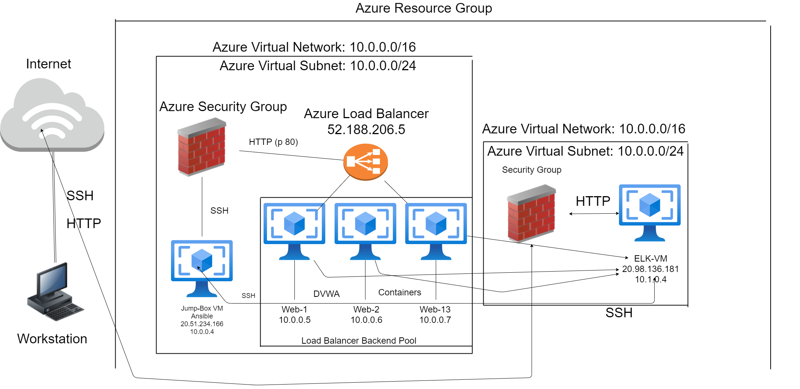

## Automated ELK Stack Deployment

The files in this repository were used to configure the network depicted below.

These files have been tested and used to generate a live ELK deployment on Azure. They can be used to either recreate the entire deployment pictured above. Alternatively, select portions of the filebeat-playbook.yml file may be used to install only certain pieces of it, such as Filebeat.

  - filebeat-playbook.yml
  - filebeat-config.yml

This document contains the following details:
- Description of the Topology
- Access Policies
- ELK Configuration
  - Beats in Use
  - Machines Being Monitored
- How to Use the Ansible Build

### Description of the Topology

The main purpose of this network is to expose a load-balanced and monitored instance of DVWA, the D*mn Vulnerable Web Application.

Load balancing ensures that the application will be highly **secure**, in addition to restricting __access___ to the network.
- What aspect of security do load balancers protect? 
  - Load balancers' off-loading function protects organizations from DDoS attacks.
  - It also helps prevent overloading servers.
- What is the advantage of a jump box?
  - Jump boxes function as secure computers that administrators can connect to first, before launching any tasks that may require connections to untrusted environments.

Integrating an ELK server allows users to easily monitor the vulnerable VMs for changes to the _____ and system _____.
- What does Filebeat watch for?_
  - Filebeat monitors the log files or locations that you specify, collects log events, and forwards them either to [Elasticsearch](https://www.elastic.co/products/elasticsearch) or [Logstash](https://www.elastic.co/products/logstash) for indexing
- What does Metricbeat record?_
  - Metricbeat records metrics and statistics from the OS and services running on the server.

The configuration details of each machine may be found below.

| Name     | Function | IP Address                              | Operating System |
| -------- | -------- | --------------------------------------- | ---------------- |
| Jump Box | Gateway  | 20.51.234.166(Public)/10.0.0.4(Private) | Linux            |
| ELK-VM   | Server   | 20.98.136.181(Public)/10.1.0.4(Private) | Linux            |
| Web-1    | Server   | 10.0.0.5                                | Linux            |
| Web-2    | Server   | 10.0.0.6                                | Linux            |

### Access Policies

The machines on the internal network are not exposed to the public Internet. 

Only the __Jump Box__ machine can accept connections from the Internet. Access to this machine is only allowed from the following IP addresses:
- My local machine's IP address.

Machines within the network can only be accessed by __Jump Box Provisioner__.
-  Which machine did you allow to access your ELK VM?
  - Jump Box
-  What was its IP address?_
  - 10.0.0.4

A summary of the access policies in place can be found in the table below.

| Name     | Publicly Accessible | Allowed IP Addresses |
| -------- | ------------------- | -------------------- |
| Jump Box | Yes                 | Local IP             |
| ELK-VM   | No                  | 10.0.0.4             |
| Web-1    | No                  | 10.0.0.4             |
| Web-2    | No                  | 10.0.0.4             |

### Elk Configuration

Ansible was used to automate configuration of the ELK machine. No configuration was performed manually, which is advantageous because...
- What is the main advantage of automating configuration with Ansible?
  - It can expedite complex tasks required for multi-tier IT infrastructure creation.

The playbook (Elk-install.yml) implements the following tasks:
- In 3-5 bullets, explain the steps of the ELK installation play. E.g., install Docker; download image; etc._
  - The first step installs Docker.
  - The next step installs Python3-pip.
  - The next step installs the Docker module within pip.
  - After that, the VM's virtual memory is increased with sysctl.
  - Next, a docker elk container is downloaded and launched.
  - Finally, the Docker service is configured to start on boot.

The following screenshot displays the result of running `docker ps` after successfully configuring the ELK instance.

### Target Machines & Beats
This ELK server is configured to monitor the following machines:
- List the IP addresses of the machines you are monitoring
  - Web-1 (10.0.0.5)
  - Web-2 (10.0.0.6)

We have installed the following Beats on these machines:
- Specify which Beats you successfully installed
  - Filebeat
  - Metricbeat

These Beats allow us to collect the following information from each machine:
- _TODO: In 1-2 sentences, explain what kind of data each beat collects, and provide 1 example of what you expect to see. E.g., `Winlogbeat` collects Windows logs, which we use to track user logon events, etc._
  - Filebeat collects log files from remote machines, Metricbeat collects machine metrics.
  - Filebeat collects logs from modules like apache, nginx, mysql, etc.
  - Metricbeat will record metrics like CPU usage, memory, etc.

### Using the Playbook
In order to use the playbook, you will need to have an Ansible control node already configured. Assuming you have such a control node provisioned: 

SSH into the control node and follow the steps below:
- Copy the ___filebeat-config.yml__ file to __/etc/ansible__.
- Update the ___filebeat-config.yml__ file to include ELK private IP in lines 1106 and 1806
- Run the playbook, and navigate to ELK-VM to check that the installation worked as expected.

_TODO: Answer the following questions to fill in the blanks:_
- Which file is the playbook? 
  - filebeat-playbook.yml
- _Where do you copy it?_
  - /etc/ansible/roles
- _Which file do you update to make Ansible run the playbook on a specific machine? _
  - /etc/ansible/hosts
- _How do I specify which machine to install the ELK server on versus which to install Filebeat on?_
  - Make two groups in the hosts file. Name one "Elk" and include the IP of the Elk-VM. Name the other group "webservers" and include the IPs of the web VMs where Filebeat will be installed.
- _Which URL do you navigate to in order to check that the ELK server is running?
  - http://20.98.136.181:5601

